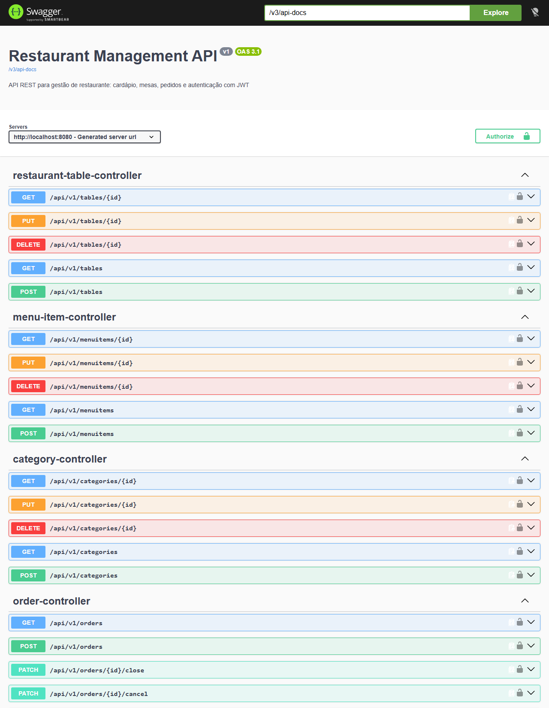
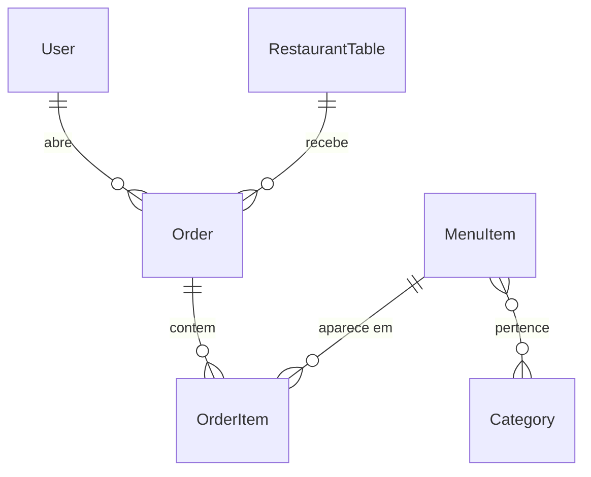

# Restaurant Management API

[](https://github.com/Iankyoo/rest-api/actions/workflows/ci.yml)

API REST para o dia a dia de um restaurante: cadastro do cardápio e das mesas, abertura de comandas, inclusão de itens e fechamento da conta. Feita com Java 21 e Spring Boot 3.5, com autenticação via JWT e permissões por perfil de usuário.



## Stack

Java 21, Spring Boot 3.5 (Web, Data JPA, Security, Validation), PostgreSQL 16, JWT (jjwt 0.12.6), Lombok, SpringDoc OpenAPI, Docker (Dockerfile multi-stage e Compose) e Maven.

Testes com JUnit 5, Mockito, MockMvc e H2. CI no GitHub Actions.

## Modelo de domínio



| Entidade | O que representa |
|---|---|
| `User` | Usuário do sistema, com perfil `CUSTOMER`, `WAITER` ou `ADMIN` |
| `Category` | Categoria do cardápio, como Bebidas ou Pratos principais |
| `MenuItem` | Item do cardápio, com preço e disponibilidade |
| `RestaurantTable` | Mesa do salão, com número, capacidade e status |
| `Order` | Comanda aberta para uma mesa |
| `OrderItem` | Item lançado na comanda |

## Regras de negócio

- Só é possível abrir comanda em mesa `AVAILABLE`. Ao abrir, a mesa passa para `OCCUPIED`; ao fechar ou cancelar, volta para `AVAILABLE`.
- Itens só entram em comandas `OPEN` e só se o item do cardápio estiver disponível.
- Comanda fechada ou cancelada não pode mais ser alterada: não aceita, não remove e não muda o status de itens, e não pode ser fechada ou cancelada de novo.
- O valor total da comanda é recalculado ao adicionar ou remover itens.
- O preço de cada item é copiado para a comanda no momento do pedido. Se o preço do cardápio mudar depois, as comandas antigas não são afetadas.
- Todo usuário novo é criado como `CUSTOMER`, com senha de no mínimo 8 caracteres. Só um `ADMIN` pode promover alguém a `WAITER` ou `ADMIN`.

## Autenticação e permissões

O login devolve um JWT, que deve ser enviado nas próximas requisições no header `Authorization: Bearer <token>`. A API é stateless: o `JwtAuthenticationFilter` valida o token a cada requisição e carrega o usuário no `SecurityContext`. As senhas são salvas com BCrypt.

O sistema foi pensado para uso interno do restaurante: o admin cuida do cardápio e das mesas, e o garçom lança e fecha as comandas. Clientes só consultam o cardápio, que é público; quem faz o pedido é o garçom, como num salão tradicional. Por isso o `CUSTOMER` não tem permissões extras: o cadastro serve para criar a conta que depois o admin promove a `WAITER`.

As regras de acesso ficam todas no `SecurityConfig`, e a coluna "Acesso" da tabela de endpoints mostra quem pode usar cada rota.

Requisição sem token ou com token inválido recebe `401`. Usuário autenticado sem o perfil necessário recebe `403`.

Ao subir, a aplicação cria um usuário `ADMIN` com as credenciais `ADMIN_EMAIL` e `ADMIN_PASSWORD` do `.env`, caso ele ainda não exista.

## Endpoints

Todas as rotas começam com `/api/v1`. As listagens são paginadas (`?page=0&size=10`).

| Método | Rota | Acesso | Descrição |
|---|---|---|---|
| POST | `/auth/register` | Público | Cria um usuário `CUSTOMER` |
| POST | `/auth/login` | Público | Autentica e devolve o JWT |
| GET | `/categories`, `/categories/{id}` | Público | Lista ou busca categorias |
| POST, PUT, DELETE | `/categories`, `/categories/{id}` | ADMIN | Cria, altera ou remove categoria |
| GET | `/menuitems`, `/menuitems/{id}` | Público | Lista ou busca itens do cardápio |
| POST, PUT, DELETE | `/menuitems`, `/menuitems/{id}` | ADMIN | Cria, altera ou remove item do cardápio |
| GET | `/tables`, `/tables/{id}` | WAITER, ADMIN | Lista ou busca mesas |
| POST, PUT, DELETE | `/tables`, `/tables/{id}` | ADMIN | Cria, altera ou remove mesa |
| POST | `/orders` | WAITER, ADMIN | Abre comanda para uma mesa |
| GET | `/orders`, `/orders/{id}` | WAITER, ADMIN | Lista comandas ou busca uma com seus itens |
| PATCH | `/orders/{id}/close` | WAITER, ADMIN | Fecha a comanda |
| PATCH | `/orders/{id}/cancel` | WAITER, ADMIN | Cancela a comanda |
| POST | `/orders/{orderId}/items` | WAITER, ADMIN | Adiciona item à comanda |
| PATCH | `/items/{itemId}/status` | WAITER, ADMIN | Muda o status do item (`PENDING`, `PREPARING`, `READY`, `DELIVERED`, `CANCELLED`) |
| DELETE | `/items/{itemId}` | WAITER, ADMIN | Remove item da comanda |
| PATCH | `/users/{id}/role` | ADMIN | Altera o perfil de um usuário |

## Erros

As exceções passam pelo `GlobalExceptionHandler`, que devolve o status adequado e um corpo no formato `{"message": "..."}`. Erros de validação devolvem um objeto com a mensagem de cada campo.

| Status | Quando acontece |
|---|---|
| 400 | Campo inválido, JSON malformado ou regra de negócio violada, como mexer em comanda fechada |
| 401 | Sem token, token inválido ou expirado, ou login com credenciais erradas |
| 403 | Usuário sem o perfil necessário |
| 404 | Recurso não encontrado |
| 409 | Email já cadastrado, mesa ocupada ou recurso em uso, como apagar uma categoria que ainda tem itens |
| 500 | Erro inesperado. O cliente recebe uma mensagem genérica e o detalhe fica só no log |

## Como rodar

Pré-requisito: Docker.

1. Crie o `.env` a partir do exemplo e preencha os valores. Para gerar o `JWT_SECRET`, use `openssl rand -base64 64`.

   ```bash
   cp .env.example .env
   ```

2. Suba o banco e a API:

   ```bash
   docker compose up --build
   ```

A API sobe em `http://localhost:8080`. O Compose só inicia a API depois que o Postgres passa no healthcheck, e o `.env` fornece as credenciais, que ficam fora do repositório.

Para desenvolver sem reconstruir a imagem a cada mudança, suba só o banco com `docker compose up -d postgres` e rode a API com `./mvnw spring-boot:run` (precisa de Java 21). Nesse modo o Spring Boot lê o `.env` direto, via `spring.config.import`.

## Documentação

Com a aplicação rodando, o Swagger fica em `http://localhost:8080/swagger-ui.html`. Para testar rotas protegidas, faça login em `POST /api/v1/auth/login`, copie o `token` da resposta e cole no botão **Authorize**.

Também dá para testar pelo terminal:

```bash
# Login com o admin criado na inicialização
curl -X POST http://localhost:8080/api/v1/auth/login \
  -H "Content-Type: application/json" \
  -d '{"email":"admin@restaurant.com","password":"<ADMIN_PASSWORD>"}'

# Criar uma categoria usando o token do admin
curl -X POST http://localhost:8080/api/v1/categories \
  -H "Content-Type: application/json" \
  -H "Authorization: Bearer <token>" \
  -d '{"name":"Bebidas","description":"Sucos e refrigerantes"}'
```

## Testes

```bash
./mvnw test
```

Os testes usam H2 em memória, então rodam sem Docker e sem `.env`. O GitHub Actions executa a mesma suíte a cada push na `main`.

- **Services:** testes unitários com Mockito, cobrindo as regras de negócio e os casos de erro.
- **Controllers:** `@WebMvcTest` com MockMvc, verificando status HTTP, validação e tratamento de erros.
- **Segurança:** permissões por perfil (401, 403 e acesso liberado), filtro JWT e geração/validação do token.
- **Integração:** um teste com `@SpringBootTest` que percorre o fluxo inteiro, do login ao fechamento da comanda, sem mocks.

## Decisões e limitações

- **`OrderItem` é uma entidade, não um `@ManyToMany`.** O item da comanda precisa guardar dados próprios: quantidade, observação, status e o preço no momento do pedido.
- **Perfis como enum.** Com três perfis fixos, um enum no `User` e `hasRole` no `SecurityConfig` resolvem. Se os perfis precisassem ser configuráveis, o caminho seria uma tabela de perfis e permissões.
- **N+1 na listagem de comandas (corrigido).** Medido com `show-sql`, um `GET /orders` com 4 comandas fazia 8 consultas: uma em `order_item` para cada comanda, mais a carga lazy dos itens do cardápio. Agora a listagem busca os itens de todas as comandas da página numa consulta só (`findByOrderIdIn`, com `@EntityGraph` trazendo o item do cardápio junto), e o mesmo cenário faz 3 consultas: usuário do token, comandas e itens.
- **Qualquer transição de status do item é aceita.** Não há validação de ordem, como impedir voltar de `DELIVERED` para `PENDING`.
- **Schema gerado pelo Hibernate** (`ddl-auto=update`). Em produção, o certo seria usar migrations versionadas com Flyway.
- **H2 nos testes.** É rápido e não depende de Docker, mas não se comporta exatamente como o PostgreSQL. Testcontainers resolveria isso.

## Autor

Ian Kiyoshi Kobayashi · [GitHub](https://github.com/Iankyoo)
